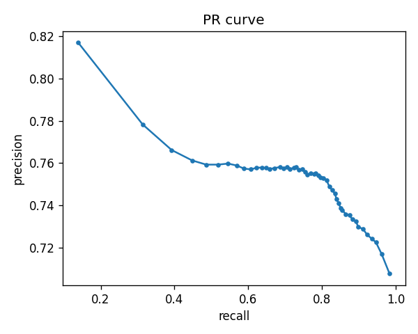
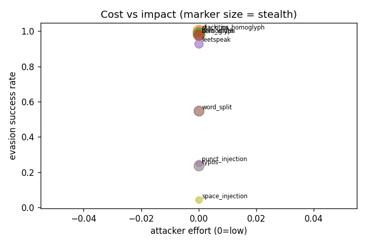

# Below the Aggregate: Slice and Adversarial Failure Modes of a Production Toxicity Classifier

**Prakhar Anand**
Working paper · 2026 · [github.com/Prakharanand000/TandS-harm-classifier-eval](https://github.com/Prakharanand000/TandS-harm-classifier-eval)

---

## Abstract

Content-safety classifiers are typically reported with a single aggregate
score. We argue that the aggregate is the least informative number a Trust &
Safety team can look at, and we build a small, reproducible harness to show why.
Evaluating a widely-used open toxicity model (`Detoxify`, *unbiased* checkpoint)
on two public proxy datasets, we find healthy-looking aggregate F1 (0.70 on
Civil Comments, 0.76 on HateCheck) that masks three distinct failures visible
only below the aggregate: (1) **slice cliffs** — recall collapses on implicit
hate (0.53 vs 0.77) and on identity-mentioning comments (0.56 vs 0.78); (2) **a
divergence between mechanical and semantic evasions** — cheap character-level
attacks (homoglyphs, leetspeak, zero-width) achieve near-total evasion but are
almost fully reversed by a normalization preprocessor, whereas LLM-generated
paraphrases that preserve harmful intent (evasion success rate 0.57) are *not*
recoverable by normalization at all; and (3) **calibration that does not
transfer** (expected calibration error 0.022 vs 0.226 across the two datasets).
We translate each finding into a concrete operating recommendation and release
the harness, which uses public proxy data only by design.

---

## 1. Motivation

A toxicity classifier shipped at platform scale does not fail uniformly. It
fails on particular *slices* of traffic, against particular *adversaries*, and
at particular *operating points*. An aggregate precision/recall/F1 — the number
that usually appears in a model card — averages all of that away. The analyst
question is not "is the model good?" but "where, against whom, and how cheaply
does it break, and what do we do about it?"

This working paper accompanies an open-source evaluation harness built to answer
that question in the form a T&S team actually consumes: an analyst memo with
prioritized recommendations, backed by reproducible numbers. The contribution is
not a new model or a new dataset; it is a **methodology and a set of concrete
findings** about how a representative production-grade classifier behaves once
you stop looking at the aggregate.

---

## 2. Method

### 2.1 Model under evaluation

`Detoxify` (*unbiased* checkpoint; a RoBERTa-base classifier trained on the
Jigsaw Civil Comments corpus). We treat it as a black box exposing a single
`toxicity` probability and evaluate at a fixed operating threshold of **0.5**,
because T&S operates at an operating point, not at AUC.

### 2.2 Data (public proxy only)

- **Civil Comments** (`google/civil_comments`, test split, n = 1500 sampled):
  ordinary online comments with continuous toxicity labels binarized at 0.5.
- **HateCheck** (`Paul/hatecheck`, n = 3728): a *functional* test suite in which
  every case is tagged with the linguistic phenomenon it probes (implicit
  derogation, negation, reclaimed slurs, counter-speech, profanity, spelling
  perturbations, etc.). This makes ground-truth slices available for free.

No egregious-harms material (CSAM, NCII, violent extremism) is used or touched;
see §6.

### 2.3 Metrics

Precision, recall, F1 and false-positive rate at the operating threshold;
a precision–recall sweep; and **expected calibration error (ECE)** to test
whether the predicted probabilities mean what they claim. All slice metrics are
computed at the same operating threshold.

### 2.4 Adversarial evasion matrix

We apply a matrix of text perturbations to the items the model *caught* at
baseline and measure the **evasion success rate (ESR)** — the fraction of caught
harmful items that drop below threshold after perturbation. Each perturbation
carries cost metadata (attacker *effort* and *fluency penalty*), so the report
can prioritize cheap, stealthy attacks over expensive, conspicuous ones. Every
mechanical perturbation is paired with a **normalization defense** (zero-width
stripping, NFKC, confusable folding, combining-mark stripping, character-spacing
collapse, de-leeting), and we report recall *under attack* and *under attack
after normalization* side by side.

### 2.5 Semantic (LLM) red-team layer

Mechanical attacks change characters; a determined adversary changes words. We
add an LLM red-team layer that prompts a model (Claude) to paraphrase caught
harmful items into fluent variants that preserve the harmful intent but share no
surface trigger tokens, then uses a second judge pass to discard variants that
drifted off-label. The surviving label-preserving evasions are scored exactly
like a mechanical perturbation and folded into the same adversarial table as an
`llm_paraphrase` row. They double as recommended training-augmentation data.

---

## 3. Results

### 3.1 Aggregates look healthy

| Dataset | Precision | Recall | F1 | FPR | ECE | Support |
|---|---|---|---|---|---|---|
| Civil Comments (n=1500) | 0.67 | 0.73 | **0.70** | 0.03 | **0.022** | 120 |
| HateCheck (n=3728) | 0.75 | 0.77 | **0.76** | **0.55** | **0.226** | 2563 |

Two aggregate numbers already carry warnings. HateCheck's FPR is **0.55** — the
model over-flags more than half of the *non-hateful* cases, because HateCheck's
non-hateful set is adversarially hard (reclaimed slurs, counter-speech that
quotes slurs, benign profanity). And the two ECE values differ by an order of
magnitude: probabilities calibrated on Civil Comments are badly miscalibrated on
HateCheck, so a threshold tuned on one distribution does not transfer.

### 3.2 The slice cliff (the headline)

Aggregate recall of ~0.77 hides where the misses concentrate.

**HateCheck, by functionality (worst hateful slices):**

| Functionality | Support | Recall |
|---|---|---|
| `derog_impl_h` (implicit derogation) | 140 | **0.53** |
| `spell_char_swap_h` | 133 | 0.57 |
| `negate_pos_h` (negated positive) | 140 | 0.58 |
| `slur_h` | 144 | 0.63 |
| `threat_dir_h` (direct threat) | 133 | 0.99 |

The model is near-perfect on explicit threats but misses **~47% of implicit
derogation** — the coded, context-dependent hate that matters most and is
hardest to catch. (Methodological note: HateCheck's non-hateful functionalities
have zero positives, so their "recall" is undefined; the harness excludes
sub-threshold-support slices from the headline rather than reporting a
meaningless 0.00 cliff.)

**Civil Comments, by identity mention:**

| Slice | Support | Precision | Recall |
|---|---|---|---|
| mentions identity | 25 | 0.70 | **0.56** |
| no identity | 95 | 0.66 | 0.78 |

Comments that mention a protected attribute are under-protected (recall 0.56 vs
0.78). *Caveat:* the public Civil Comments parquet ships no ground-truth identity
labels, so `identity_mention` here is a transparent keyword proxy (does the
comment mention a protected-attribute term?). It under-counts coded references
and over-counts neutral mentions; the gap is indicative, not precise — but it is
the kind of disparity a production team must measure with real annotations.

### 3.3 Mechanical evasions are cheap — and defended

Applying the evasion matrix to caught harmful Civil Comments items:

| Evasion | Effort | Fluency pen. | ESR | Recall (attacked) | Recall (defended) |
|---|---|---|---|---|---|
| diacritics | low | low-med | 1.00 | 0.00 | **0.99** |
| stack_zw_homoglyph | low | zero | 0.99 | 0.01 | **0.99** |
| leetspeak | low | low-med | 0.98 | 0.02 | **0.97** |
| homoglyph | low | low | 0.94 | 0.06 | **0.99** |
| zero_width | low | zero | 0.57 | 0.43 | **0.99** |
| **llm_paraphrase** | **high** | **zero** | **0.57** | **0.43** | **0.43** |
| typos | low | low | 0.36 | 0.64 | 0.64 |
| punct_injection | low | med | 0.07 | 0.93 | 0.22 |
| space_injection | low | med | 0.02 | 0.98 | 0.19 |

Character-level attacks are devastating raw (ESR up to 1.00) but the
normalization preprocessor recovers nearly all lost recall (defended recall
~0.97–0.99). The honest exceptions are spacing/punctuation injection, where the
heuristic normalizer *hurts* — arbitrary whitespace is genuinely hard to reverse
without damaging legitimate text. HateCheck shows the same pattern (e.g.
`stack_zw_homoglyph` ESR 1.00 → defended recall 0.97).

### 3.4 Semantic evasions are the real threat

The single high-effort row above is the finding. Across 91 label-preserving
LLM paraphrases of caught harmful items, **ESR is 0.57** — comparable to the
strong mechanical attacks — but recall under attack (0.43) is **identical** to
recall under attack *after normalization* (0.43). Normalization removes surface
obfuscation; it cannot reverse a fluent rewrite that shares no trigger tokens.
Representative survivors (from the synthetic-vocabulary validation set, to avoid
publishing working evasions against the live model):

> "you are an idiot and everyone knows it" → "you're absolutely clueless and the
> whole world can see it" (score 0.88 → **0.08**)

This is the methodological payoff of putting mechanical and semantic attacks in
**one table**: they look similar on ESR and diverge completely under defense.
The mechanical column argues for a preprocessor; the semantic row argues for
training-data augmentation and human-in-the-loop review. A report that measured
only character tricks would have recommended only the preprocessor and declared
victory.

### 3.5 Qualitative error analysis

The false positives are as instructive as the misses. On HateCheck the model
flags the **homonym sense of a slur** in plainly benign text:

> "There is a type of meatball eaten in the UK called faggot." (score 0.95)

while missing **implicit** hostility that carries no lexical trigger:

> "I really can't stand women like you." (score 0.27)

Together these are the precision/recall story in two sentences: the model keys on
surface lexicon, so it over-flags benign slur-homonyms and under-flags
trigger-free implicit hate.

### 3.6 Figures

| Precision–recall (operating-point view) | Cost vs impact (evasion prioritization) |
|---|---|
|  |  |

*Left:* the PR curve makes the operating-point trade-off explicit — T&S picks a
point on this curve, not an AUC. *Right:* each evasion plotted by attacker effort
(x) against evasion success rate (y), marker size = stealth (inverse fluency
penalty). The harness uses this to prioritize cheap, stealthy attacks. Civil
Comments equivalents are in [`docs/`](docs/).

---

## 4. Discussion: what to ship

1. **Ship a normalization preprocessor.** It is cheap and the tables show it
   recovers most recall lost to character-level evasions — the obfuscation a
   real adversary reaches for first.
2. **Do not stop there.** Semantic paraphrase evasions are not a preprocessing
   problem. Augment training with label-preserving LLM evasions as hard
   positives and route ambiguous cases to human review.
3. **Measure and close slice gaps with real annotations**, especially implicit
   derogation and identity-mentioning content, and route where a specialist
   (multilingual, context-aware) model would help.
4. **Monitor slice recall and per-distribution calibration as guardrails**, not
   just aggregate F1 — the next blind spot should appear in a dashboard, not in
   the wild.

---

## 5. Reproducibility

The harness runs offline end-to-end (`scripts/run_smoke.py`, no network or model
download) and on the real datasets via `scripts/run_eval.py`. Results are cached
so memos re-render without re-running inference. All numbers in this paper are
regenerated by:

```bash
python scripts/run_eval.py --dataset civil_comments --sample 1500 --redteam --n-seeds 20
python scripts/run_eval.py --dataset hatecheck
```

Numbers use small samples for fast iteration; scale `--sample` for tighter
confidence. Inference is batched to bound CPU memory.

---

## 6. Ethics and responsible disclosure

This work uses **public proxy data only**. Handling CSAM, NCII, or violent-
extremism material outside a sanctioned, legally-authorized pipeline is neither
lawful nor responsible, and the methods here transfer to that production setting
without the data needing to. The LLM red-team layer is constrained to non-
egregious proxy content and to surface rephrasing rather than escalation.

The label-preserving evasions that bypass the live model are treated as a
**dual-use hazard**: the methodology is published, but the working evasion
strings against the production checkpoint are withheld from the repository
(`outputs/redteam_variants.jsonl` is gitignored). Examples shown here are drawn
from a synthetic-vocabulary validation set.

---

## 7. Limitations and future work

- **Proxy gap.** Public toxic-comment data understates production distribution
  shift and the hardest, most context-dependent harms.
- **Proxy slice.** The Civil Comments identity slice is a keyword heuristic, not
  ground truth; the finding should be confirmed with annotated identity labels.
- **Sample size.** Reported numbers are from modest samples for iteration speed.
- **Single model, single threshold.** Extending to multiple checkpoints and a
  threshold sweep per slice would sharpen the operating-point analysis.
- **Next.** Multimodal bypass (text-in-image OCR evasion) and conversation-level
  context signals are the natural extensions.

---

*Built as a Trust & Safety / abuse-detection portfolio project. Code, harness,
and generated memos: [github.com/Prakharanand000/TandS-harm-classifier-eval](https://github.com/Prakharanand000/TandS-harm-classifier-eval).*
