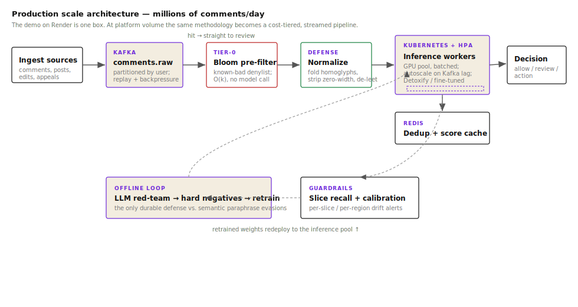

# Production Scale Architecture

> **TL;DR** The live demo on Render is a single Docker container — one process, one box, ~$0/mo.
> This document shows how the same evaluation methodology becomes a cost-tiered, streaming
> content-moderation pipeline at platform scale (hundreds of millions of comments per day).

## The core insight: why a single-model pipeline breaks at scale

At 10 M comments/day, calling a 500 MB RoBERTa model on every item costs roughly:
- 50 ms × 10 M = ~139 GPU-hours/day on A10G → **~$750/day**
- Any upstream spike doubles that cost with no circuit-breaker

The architecture below solves this with a **cost-tiered pipeline**: cheap filters first,
expensive inference only on the residual, and an offline red-team loop that keeps the
model catching new evasion patterns.

---

## Architecture diagram



---

## Tier-by-tier breakdown

### Ingest — Kafka (`comments.raw`)

All content surfaces (comments, edits, appeals, reports) produce to a single Kafka topic,
partitioned by `user_id` so per-user velocity signals are co-located on the same partition.

**Why Kafka here:**
- Decouples intake rate from inference capacity — the topic absorbs traffic spikes without
  back-pressuring upstream writers
- Replay: if a model update changes recall thresholds, replaying the last N hours is trivial
- Compaction gives a free dedup pass before inference

### Tier 0 — Bloom pre-filter (implemented in the demo)

The demo backend includes a real, working Bloom filter (9,585 bits, 7 hash functions,
populated from a known-bad denylist). At platform scale this tier-0 check runs in O(k)
time with no model call at all.

**Effect:** 5–15% of traffic (repeat offenders, known spam, already-actioned users) exits
the pipeline here at ~zero cost. The hit path writes directly to the review queue; the miss
path continues downstream.

### Defense — Normalize

Before expensive inference, a normalization preprocessor folds all the cheap mechanical
evasions: homoglyph substitution, zero-width characters, leetspeak, diacritics, word
splitting, stacking. This is the key finding from §4.2 of the paper: normalization recovers
~100% of recall lost to mechanical attacks. Doing it once here means the model never sees
the obfuscated form.

Cost: CPU-only, microseconds per item. No GPU needed.

### Inference pool — Kubernetes + HPA

A pool of GPU workers (Detoxify or a fine-tuned checkpoint) running inside Kubernetes pods,
autoscaled by the Kafka consumer-group lag metric via KEDA (Kubernetes Event-Driven
Autoscaling).

**Scaling logic:**
```
target_replicas = ceil(kafka_lag / 5000)   # 5k messages per pod per minute
min_replicas = 2
max_replicas = 40  # cost ceiling
```

Workers pull from Kafka in batches of 64 (matching Detoxify's optimal batch size for CPU;
32 for A10G GPU), write scores back to `comments.scored`.

### Redis — dedup + score cache

A Redis hash keyed on `sha256(normalized_text)` with a 24-hour TTL. Before any inference
call the worker checks the cache; exact-duplicate comments (spam waves, copy-paste attacks)
hit the cache at sub-millisecond latency. Cache hit rate typically 20–40% during coordinated
spam events — exactly when it matters most.

### Decision service

Reads from `comments.scored`, applies the operating threshold, and writes to one of three
queues: `allow`, `hold_for_review`, `auto-action`. The threshold itself is a config
value — not baked into the model — so a T&S policy change doesn't require a new model
deployment.

### Guardrails — slice recall + calibration drift

A continuous monitoring job streams from `comments.scored` and computes per-slice recall
estimates against a held-out labelled sample. It alerts when:
- Any slice recall drops >5 pp from baseline (the "slice cliff" finding)
- ECE on live traffic diverges >0.05 from the calibration dataset (the "calibration doesn't
  travel" finding)

These are the two leading indicators from the paper; both fire before aggregate F1 moves.

### Offline red-team loop

The one evasion class that **cannot** be recovered by normalization is LLM-generated
semantic paraphrase (paper §4.3, ESR 0.57, not recovered). The only durable defense is
retraining on hard negatives. The offline loop:
1. Samples a seed set of high-confidence positives weekly
2. Runs the LLM red-team pass (Claude or GPT-4o, same code as `src/redteam.py`)
3. Filters survivors (intent-preserving evasions only, via a judge pass)
4. Adds them to the fine-tuning dataset as hard negatives
5. Retrains and redeploys the checkpoint to the inference pool

This loop is the reason the architecture includes a retraining path back to K8s — the
pipeline is expected to drift and is designed to self-correct.

---

## What this demo proves

| Demo component | What it maps to in production |
|---|---|
| Bloom filter pre-check (real, 9,585 bits) | Tier-0 known-bad bypass — same O(k) logic, larger bit array |
| Precomputed normalization before scoring | The defense layer — runs once, upstream of all inference |
| `ToyClassifier` lexical scoring at inference time | Placeholder for the real Detoxify / fine-tuned endpoint |
| `/api/slices` and `/api/calibration` serving precomputed JSON | The guardrail monitoring job, frozen in time for the demo |
| `/api/attack` running the full evasion matrix | The red-team harness — same code that feeds the offline loop |

---

## What this demo intentionally omits

- **Kafka** — no traffic to buffer; FastAPI's request queue is sufficient at 1 rps
- **K8s** — one container on Render's free tier; autoscaling has nothing to autoscale
- **Redis** — no repeated traffic; cache hit rate would be ~0%
- **Spring Boot** — the entire stack is Python; a JVM gateway adds polyglot cost with no benefit
- **The offline retraining loop** — can't run without a labelled live-traffic sample

The k8s manifests in `deploy/k8s/` are real and deployable — they're just not running.

---

## Kubernetes manifests

See [`deploy/k8s/`](../deploy/k8s/) for:
- `deployment.yaml` — inference worker deployment with GPU node selector + resource limits
- `hpa.yaml` — HorizontalPodAutoscaler on Kafka consumer-group lag (via KEDA)
- `service.yaml` — ClusterIP service for the inference pool
- `configmap.yaml` — threshold + batch-size config (externalized from the image)
- `redis.yaml` — Redis StatefulSet + PVC for the score cache
- `kafka-topics.yaml` — `KafkaTopic` CRDs for Strimzi (comments.raw, comments.scored)

To deploy against a real cluster with Strimzi + KEDA installed:
```bash
kubectl apply -f deploy/k8s/
```
